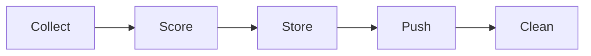

# Intel Hub

> **Intelligent Financial News Aggregation & Push System**  
> A production-grade pipeline that collects → scores → stores → pushes curated financial intelligence

[](https://www.python.org/downloads/)
[]()
[]()

## 📋 Table of Contents

- [Overview](#overview)
- [Features](#features)
- [Architecture](#architecture)
- [Installation](#installation)
- [Configuration](#configuration)
- [Usage](#usage)
- [Output Formats](#output-formats)
- [Testing](#testing)
- [Security](#security)
- [Roadmap](#roadmap)
- [License](#license)

## 🎯 Overview

Intel Hub automates the discovery and delivery of relevant financial events from diverse sources. It focuses on fast, lightweight, and intelligent aggregation of market signals across equities, crypto, IPOs, and macroeconomics.
> Note: Source code comments are in Chinese for clarity and authenticity.  
> The project is fully self-developed and readable regardless of language.
### Core Pipeline



1. **Collect** - Financial news and events from multiple sources (RSS, JSON APIs, blogs)
2. **Score** - Rank by relevance, keywords, and topics
3. **Store** - Valid events into a short-lived database (48h retention)
4. **Push** - Summaries or instant alerts via Telegram
5. **Clean** - Automatic cleanup of old records

## ✨ Features

| Feature | Description |
|---------|-------------|
| **Multi-source Ingestion** | RSS, JSON, or custom API connectors |
| **Relevance Scoring** | Weighted by topic, keyword, and source importance |
| **Short-lived Storage** | SQLite with 48-hour auto-cleanup (PostgreSQL ready) |
| **Smart Delivery** | Terminal digest + Telegram notifications |
| **Automation Ready** | Cron/systemd scheduling (08:00 AM / 20:00 PM) |

## 🏗️ Architecture

### Project Structure

```
intel-hub/
├── app/
│   ├── parsers/           # Source adapters
│   │   ├── rss_default.py
│   │   ├── json_default.py
│   │   └── dummy_gen.py
│   ├── collector.py       # Collection and deduplication
│   ├── scorer.py          # Keyword/topic-based scoring
│   ├── storage.py         # Database operations
│   ├── notifier.py        # Telegram/Email/Web delivery
│   ├── models.py          # Data schema definitions
│   ├── utils.py           # Helper utilities
│   └── main.py            # Main orchestrator
│
├── ops/
│   ├── config.yml         # Main configuration
│   ├── sources.yml        # Feed definitions
│   ├── keywords.yml       # Tracking entities
│   ├── topics.yml         # Topic categories
│   └── universe.yml       # Unified control
│
├── tests/
│   ├── run_pipeline_demo.py
│   ├── test_push.py
│   ├── test_storage.py
│   └── test_all.py
│
├── requirements.txt
├── Makefile
├── run_all.sh
├── intel.db
└── README.md
```

## 🚀 Installation

### Prerequisites

- Python 3.8+
- SQLite3
- Git

### Setup Steps

```bash
# Clone repository
git clone https://github.com/<yourusername>/intel-hub.git
cd intel-hub

# Create virtual environment
python3 -m venv venv
source venv/bin/activate  # On Windows: venv\Scripts\activate

# Install dependencies
pip install -r requirements.txt
```

## ⚙️ Configuration

### Main Configuration (`ops/config.yml`)

```yaml
run:
  cycles: ["08:00", "20:00"]
  max_items: 200

storage:
  ttl_hours: 48
  sqlite_path: "intel.db"

scoring:
  base: 10
  boost:
    topic_match: 10
    keyword_hit: 5
    trusted_source: 5
  threshold:
    alert: 30      # Instant push threshold
    digest: 15     # Include in digest threshold

notifier:
  telegram:
    enabled: true
    bot_token: "${TELEGRAM_BOT_TOKEN}"
    chat_id: "${TELEGRAM_CHAT_ID}"
```

### Source Configuration (`ops/sources.yml`)

```yaml
rss:
  - id: tradingview_news
    url: https://www.tradingview.com/ideas/rss/
    weight: 1.0
    
  - id: nvidia_news
    url: https://blogs.nvidia.com/feed/
    weight: 1.2
    
  - id: microsoft_news
    url: https://news.microsoft.com/feed/
    weight: 1.0
    
  - id: google_blog
    url: https://blog.google/technology/rss/
    weight: 1.1
```

## 📖 Usage

### Manual Execution

```bash
# Direct Python execution
python app/main.py

# Using Makefile
make run
```

### Automated Scheduling

#### Using Cron

```bash
# Edit crontab
crontab -e

# Add schedule (8:00 AM and 8:00 PM daily)
0 8,20 * * * cd /path/to/intel-hub && /bin/bash run_all.sh >> run.log 2>&1
```

#### Using Systemd Timer

Create service file at `/etc/systemd/system/intel-hub.service`

## 📊 Output Formats

### 1. Terminal Digest

Real-time console output during execution:

```
[2025-10-16 08:00:01] Starting Intel Hub collection cycle...
[rss] tradingview_news captured: CONTINUATION OF BULL RUN
[scorer] Stored: TSLA Likely to Continue Rising if Holding Above $440 (score=30.0)
[rss] ithome_news captured: Huawei Mate X5 Series Upgrades HarmonyOS 5.1.0... (score=20.0)
[cleanup] Removed 45 records older than 48 hours
[2025-10-16 08:00:45] Cycle complete: 127 new events processed
```

### 2. Database Storage

**Schema Design**

| Field | Type | Description |
|-------|------|-------------|
| `id` | INTEGER | Primary key |
| `headline` | TEXT | News headline |
| `source` | TEXT | Source identifier |
| `topic` | TEXT | Topic category |
| `score` | REAL | Relevance score (0-100) |
| `link` | TEXT | Original URL |
| `created_at` | TIMESTAMP | Entry timestamp |

**Query Examples**

```sql
-- Get recent high-score events
SELECT headline, source, score 
FROM events 
WHERE score >= 30 
  AND created_at > DATETIME('now','-24 hours')
ORDER BY score DESC;

-- Cleanup query (auto-executed)
DELETE FROM events 
WHERE created_at < DATETIME('now','-48 hours');
```

### 3. Telegram Push Notifications

**Message Types**

- **Morning Digest** (08:00) - Daily market overview
- **Evening Digest** (20:00) - Day-end wrap-up  
- **Instant Alert** - Triggered when score ≥ 30

**Example Output**

```
📊 Intel Hub Alert - Oct 16, 2025

⚡ HIGH PRIORITY (Score 30+)
• NVDA rebounds 4% amid AI chip demand recovery
• SEC expected to approve new RWA-backed bond ETF

📈 MARKET MOVERS
• BTC consolidates near $63k; ETF inflows remain strong
• TSLA production numbers exceed Q3 estimates

🔍 View full report: [Link]
```

## 🧪 Testing

### Run Test Suite

```bash
# Full test suite
pytest tests/

# Individual components
python tests/test_storage.py
python tests/test_push.py

# Pipeline demo
python tests/run_pipeline_demo.py
```

### Test Coverage

- ✅ Source parsing and validation
- ✅ Scoring algorithm accuracy
- ✅ Database CRUD operations
- ✅ 48-hour cleanup mechanism
- ✅ Telegram API integration
- ✅ Deduplication logic

## 🔒 Security

### Best Practices

- **Environment Variables**: All sensitive data (API tokens, credentials) stored as env vars
- **Configuration**: Sensitive configs excluded via `.gitignore`
- **Data Retention**: 48-hour automatic cleanup for privacy
- **Access Control**: Read-only for data sources, write-only for notifications

### .gitignore Configuration

```
# Python
__pycache__/
*.pyc
venv/

# Database
*.db
*.sqlite

# Logs
*.log
logs/

# Configuration
ops/config.yml
ops/sources.yml
ops/keywords.yml
ops/topics.yml
ops/universe.yml
!ops/*_example.yml

# IDE
.vscode/
.idea/
.DS_Store
```

## 🗺️ Roadmap

### Phase 1: Core Enhancement
- [x] Basic RSS/JSON parsing
- [x] Keyword-based scoring
- [x] SQLite storage
- [x] Telegram integration
- [ ] NLP sentiment analysis
- [ ] Advanced deduplication (text fingerprinting)

### Phase 2: Scale & Performance
- [ ] PostgreSQL support
- [ ] Redis caching layer
- [ ] Async processing
- [ ] Distributed collection

### Phase 3: Advanced Features
- [ ] Web dashboard (Flask/FastAPI)
- [ ] Custom keyword watchlists
- [ ] ML-based relevance scoring
- [ ] Multi-language support
- [ ] Historical analytics

## 📄 License

**© 2025 - All Rights Reserved**

This repository is shared for portfolio demonstration purposes only.  
Unauthorized use for coursework or commercial applications is strictly prohibited.

